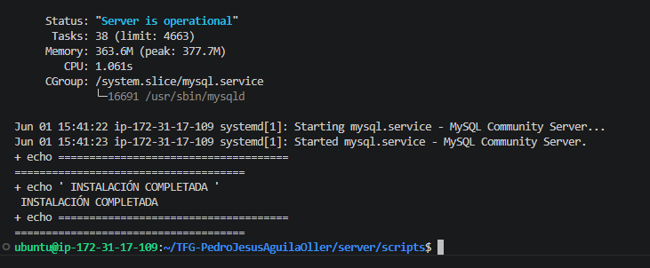
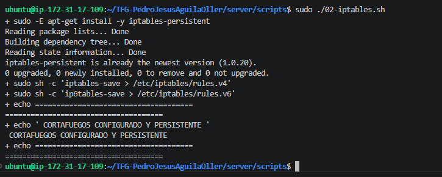
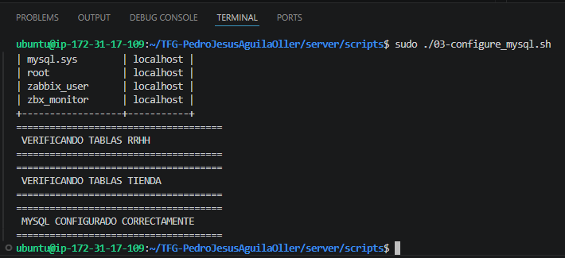
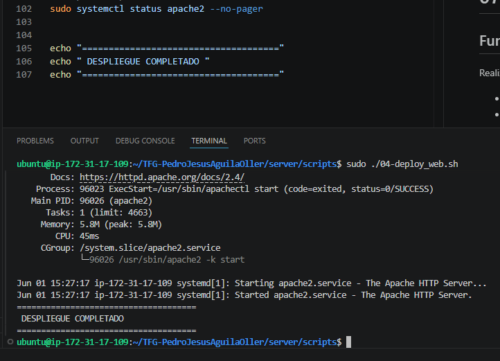
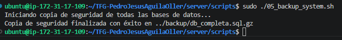
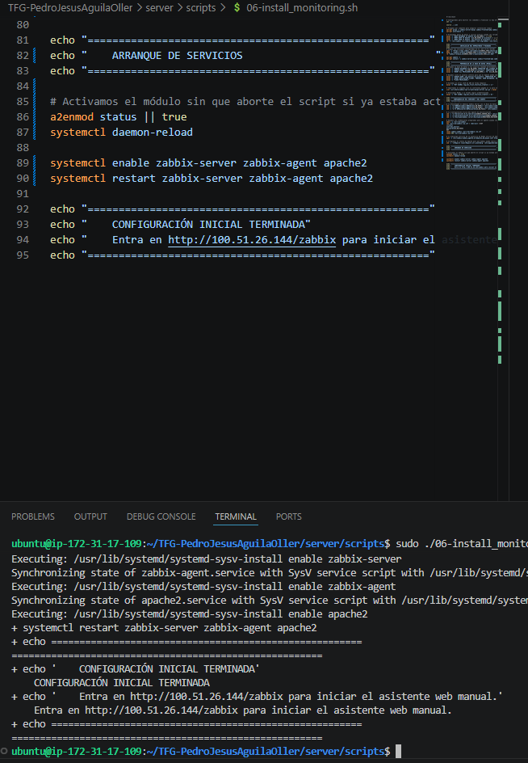
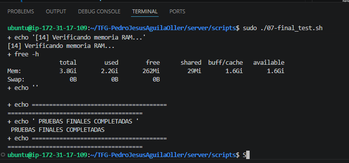
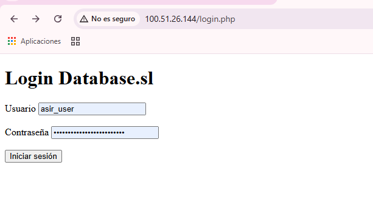
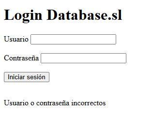
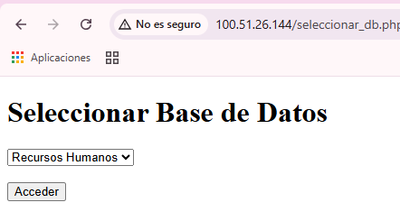

# Despliegue Automatizado y Manual de Usuario

Este documento demuestra la correcta ejecución de la infraestructura como código de este proyecto y verifica el funcionamiento de la aplicación web desplegada.

---

## 1. Verificación de Scripts de Despliegue

El levantamiento del servidor se realiza mediante siete scripts secuenciales. A continuación se evidencia la ejecución exitosa de cada uno de ellos, garantizando que no hay roturas de dependencias ni fallos de configuración.

### Script 01: Instalación del entorno LAMP
Se encarga de limpiar instalaciones previas, actualizar el sistema y levantar Apache, MySQL y PHP desde cero.
`sudo ./scripts/01-install_lamp.sh`

### Script 02: Configuración del Firewall (iptables)
Blinda el servidor estableciendo políticas restrictivas y dejando abiertos solo los puertos necesarios para la IP autorizada.
`sudo ./scripts/02-iptables.sh`

### Script 03: Configuración de MySQL
Aplica el hardening a la base de datos, elimina usuarios por defecto y prepara los esquemas de la aplicación.
`sudo ./scripts/03-configure_mysql.sh`

### Script 04: Despliegue de la Aplicación Web
Copia el código fuente PHP al directorio de Apache y ajusta los permisos de lectura y escritura.
`sudo ./scripts/04-deploy_web.sh`

### Script 05: Sistema de Copias de Seguridad
Programa y ejecuta el primer backup completo de la base de datos y los archivos web.
`sudo ./scripts/05-backup_system.sh`

### Script 06: Instalación de Monitorización (Zabbix)
Despliega Zabbix Agent, vincula la monitorización de la base de datos y reinicia los servicios.
`sudo ./scripts/06-install_monitoring.sh`

Como parte del sistema de monitorización del servidor, se instaló Zabbix para supervisar el estado general de la infraestructura.

Se verificó correctamente:
- instalación del servidor Zabbix
- funcionamiento del agente
- acceso al panel web

### Captura de instalación

### Script 07: Pruebas Finales del Sistema
Ejecuta una batería de comprobaciones automáticas para validar que los servicios responden correctamente.
`sudo ./scripts/07-final_test.sh`

---

## 2. Manual de Usuario: Prueba de Autenticación

Una vez montada y asegurada la infraestructura, procedemos a validar la lógica de la aplicación web, comprobando específicamente el sistema de login en PHP conectado a nuestra base de datos.

### 2.1 Acceso a la plataforma
Abrimos el navegador web e introducimos la IP pública del servidor autorizado para acceder al formulario de inicio de sesión.

### 2.2 Validación de seguridad (Intento fallido)
Para comprobar que la conexión con la base de datos filtra correctamente a los intrusos, introducimos unas credenciales erróneas. El sistema deniega el acceso y lanza el aviso correspondiente.

### 2.3 Acceso exitoso
Introducimos el usuario y contraseña del administrador registrados durante el despliegue. El sistema valida el *hash*, genera la sesión en PHP y nos da acceso al panel principal de la aplicación.
